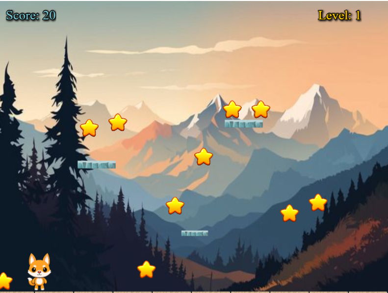

# 🎯 Collect Game

Sebuah game 2D sederhana di mana pemain harus mengumpulkan item sebanyak mungkin sambil menghindari rintangan. Cocok untuk melatih kecepatan dan ketepatan pemain!

---

## 🎮 Tampilan Gameplay

### 🚀 Play
Tampilan saat permainan berlangsung. Pemain mengontrol karakter untuk mengumpulkan item tertentu dan mencetak skor.



---

## ⚙️ Teknologi yang Digunakan

- **Game Engine:** [Contoh: Unity, Godot, GDevelop, HTML5 Canvas]
- **Bahasa Pemrograman:** [HTML, JavaScript]
- **Assets:** Custom / Open-source (ikon item, karakter, latar)

---

## 🚀 Cara Menjalankan Game

1. Clone repository:
   ```bash
   git clone https://github.com/username/collect-game.git
